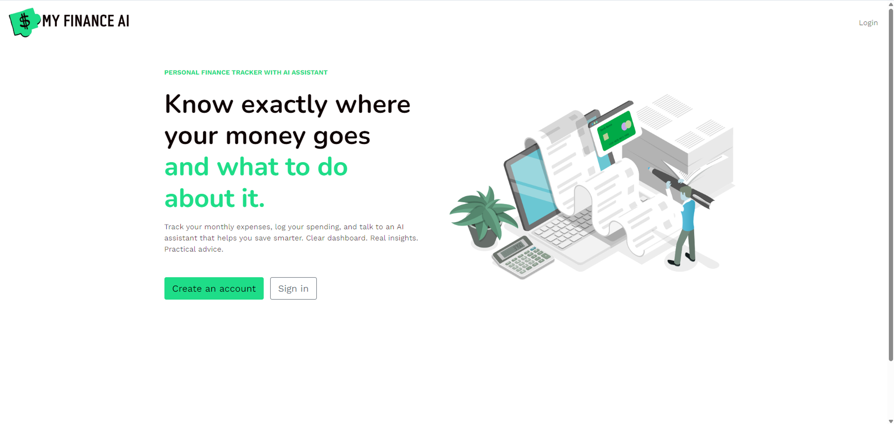
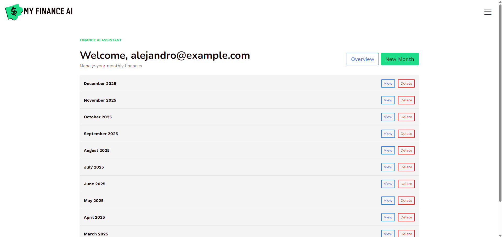
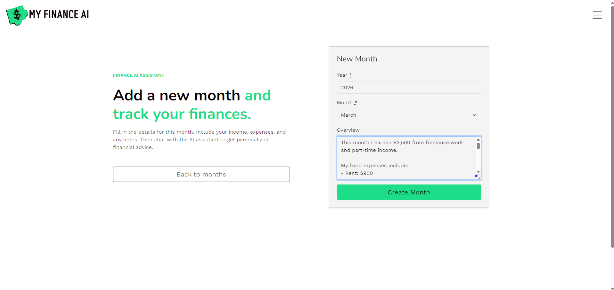
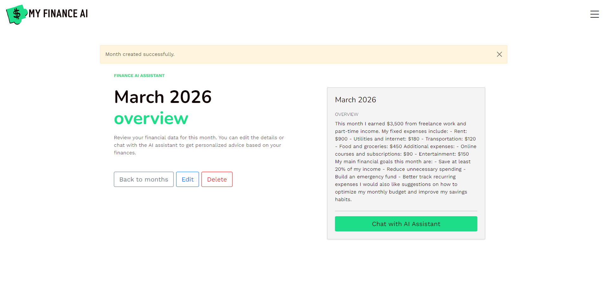
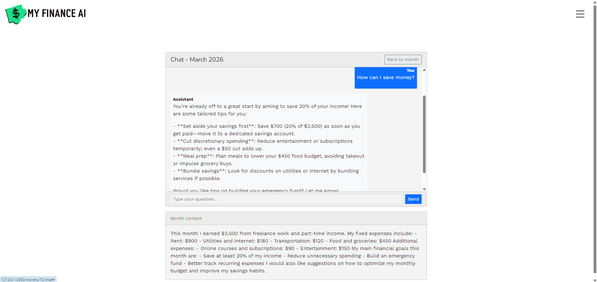

# Finance AI Assistant

A Rails app that helps you track monthly finances and chat with an AI assistant for personalized advice based on your financial overview and extracted data.

## Features

- **Months:** Create and edit months with a text overview (income, expenses, categories).
- **Financial data extraction:** The app uses an LLM to parse your overview into structured data (income, expenses, categories) stored in each month.
- **Dashboard:** View aggregated income, expenses, balance, savings rate, and category breakdown across all your months.
- **Chat:** One chat per month; ask the AI questions and get advice based on your overview and extracted financial data. Uses Turbo Streams for a smooth, no-reload experience.

## Requirements

- Ruby 3.3.5
- PostgreSQL
- API key for the LLM (OpenAI or Gemini)

## Setup

```bash
bundle install
rails db:create db:migrate db:seed
```

Create a `.env` file in the project root with your API key:

```
OPENAI_API_KEY=your_key_here
# or
GEMINI_API_KEY=your_key_here
```

Then start the server:

```bash
rails server
```

## Main routes

- `/` — Landing (home)
- `/months` — List of your months (requires login)
- `/months/:id` — Single month view with financial summary and link to chat
- `/months/:month_id/chat` — Chat with the AI for that month
- `/dashboard` — Aggregated financial overview across all months

## Tech stack

- Rails 7, Devise, Bootstrap, Hotwire (Turbo, Stimulus), Simple Form, ruby_llm, PostgreSQL, JavaScript, HTML & CSS, Bootstrap, Git & GitHub.

- ## Screenshots

### Landing Page



### Home page



### Add Month



### View Month



### Chat AI


